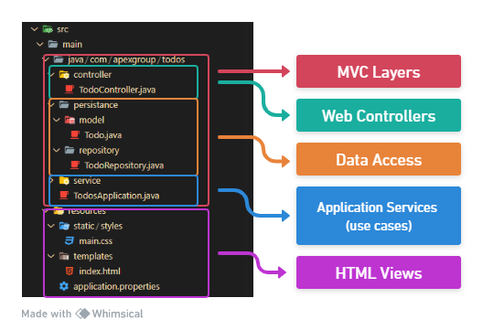

# Apex Group - DevOps Role Interview

The Apex Group DevOps team has been working for a few weeks in an app for managing To-Do's list. This app will provide insights on _in progress_ and _to do_ tasks for each squad.


You have been requested to implement some new features related to improved To-Do management and reporting capabilities:

## MVC
You are requested to add a Due Date attribute to the To-Do entity and display the To-Do list sorted by this Due Date in ascending order. This feature should prevent the creation of To-Dos with a duedate that has already passed (earlier than today).

### Questions

❓ How would you add the `duedate` attribute to the To-Do entity?

❓ How would you handle the creation of To-Dos with a past `duedate`?

❓ How would you integrate the `duedate` field into the user interface?

## Reporting - SQL
Another team member has been working on adding both the squad and assignee, resulting in the following database schema.

<p align="center">

</p>

---

<details style="margin-top: 20px; margin-bottom: 20px;">
<summary style="font-size: 18px"><b>Database Schema (SQL)</b></summary>

```sql
CREATE TABLE todo (
    todo_id INT PRIMARY KEY,
    description VARCHAR(255) NOT NULL,
    due_date DATE NOT NULL,
    assignee_id INT,
    squad_id INT,
    FOREIGN KEY (assignee_id) REFERENCES assignee(assignee_id),
    FOREIGN KEY (squad_id) REFERENCES squad(squad_id)
);


CREATE TABLE assignee (
    assignee_id INT PRIMARY KEY,
    name VARCHAR(255) NOT NULL,
);

CREATE TABLE squad (
    squad_id INT PRIMARY KEY,
    name VARCHAR(255) NOT NULL,
);

CREATE TABLE assignee_squad (
    assignee_id INT,
    squad_id INT,
    PRIMARY KEY (assignee_id, squad_id),
    FOREIGN KEY (assignee_id) REFERENCES assignee(assignee_id),
    FOREIGN KEY (squad_id) REFERENCES squad(squad_id)
);

```
</details>

---

### Questions

❓ How would you retrieve the count of To-Dos per assignee (by name), grouped by squad (name)?

❓ How would you find To-Dos expiring in the next 2 weeks?

## Getting Started

This project is an executable Java 21 webserver. It uses Gradle as package manager. To be able to run the project in development mode (both debug and run configurations) it is needed to use Gradle tasks.

The project is structured as following:

<p align="center">
    
</p>

* Springboot monolith with SSR using Thymeleaf
    * Web Controllers: handles HTTP Request and maps them to use cases (application services), returning a redirection or an HTML view.
    * Application services: handles use cases orchestration, with access to data access layer via repositories.
    * Data Access: both entities and its mapping to database and Repositories (how to fetch entities from database)
    * HTML Views: SSR templates using Thymeleaf for rendering HTML pages.

### Requirements

* VS Code-based editor: `GitHub Codespaces`, `Cloud9`, `Cursor` are also valid.
* Container runtime w/ Docker compatibility: Docker Desktop/OrbStack

---

### Installation

To be able to run the application from your laptop, you'll have to:

1. Clone the repository

```bash
git clone https://github.com/sannegroup/devops-java-tech-interview
```
2. Open the repository with your editor

3. Once you have opened the project, a pop-up must show up in your screen that ask you yo open in `devcontainer`:


4. Click on `Reopen in Container`

5. Once the workspace has been properly initialized, you'll have the Gradle extension in your toolbar

<p align="center">
    
</p>

6. To start the application, hit on "▶️" or "🪲" icons on `bootRun` task.

7. Then, you can access to `http://localhost:8080/`
